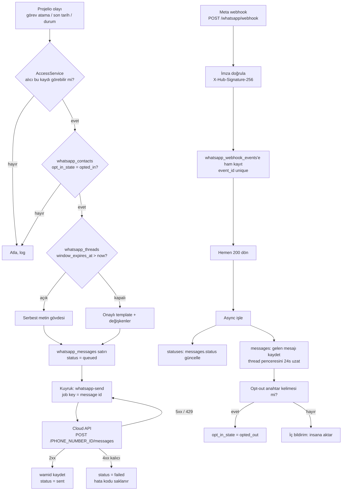

# WhatsApp Entegrasyonu — MVP Teknik Spec

> **⛔ BU YOL SEÇİLMEDİ — ARŞİV BELGESİ.** Aşağıdaki Meta Cloud API tasarımı
> hiç uygulanmadı ve uygulanması planlanmıyor. Dosya yalnızca *ileride resmi
> API'ye geçilirse* karar girdileri elde olsun diye duruyor.
>
> **Bugün canlıda olan sistem tamamen farklıdır:** QR ile bağlanan numara +
> WAHA yan-servisi. Gerçek tasarım, tarihçe ve sunucu adımları:
> `docs/whatsapp-qr-plan.md`. Modül özeti: `docs/moduller/16-whatsapp.md`.
>
> Aşağıdaki hiçbir şey kodda yoktur: Meta onaylı template'ler, 24 saatlik
> hizmet penceresi, konuşma başına faturalama, Meta webhook challenge.
> Kodda gerçekte olanlar (`backend/src/modules/whatsapp/`, migration 080-082):
> numara havuzu, QR eşleştirme, opt-in, hız sınırı ve jitter, HMAC imzalı
> webhook, oturum uzlaştırma.
>
> *(Not: bu dosyanın eski başlığı "repoda henüz `backend/src/modules/whatsapp/`
> yok" diyordu — 2026-09-03 itibarıyla yanlış: 20 dosyalık modül canlıda.)*

Karar girdileri (tartışmaya kapalı, üstten verildi):

- Üretim yolu **Meta WhatsApp Cloud API**. Resmi olmayan WhatsApp Web
  otomasyonu (Baileys, whatsapp-web.js, WAHA) üretim dışıdır.
- 24 saatlik hizmet penceresi kuralı geçerlidir: pencere açıkken serbest metin,
  kapalıyken yalnızca **onaylı template**.
- Şahsi numarayı taşıma (coexistence) MVP kapsamında değildir.

---

## 1. Kapsam ve kapsam dışı

### Kapsam (MVP)

1. Bir organizasyona **tek bir WhatsApp Business numarası** bağlanabilir
   (Cloud API phone number id + kalıcı erişim jetonu).
2. Projelio kullanıcıları ve dış kişiler (müşteri, taşeron) için **WhatsApp
   kişi kaydı** ve numara eşleme.
3. **Giden bildirim**: görev atama, son tarih hatırlatma, durum değişikliği —
   pencere kapalıysa onaylı template ile.
4. **Gelen mesaj**: webhook'tan alınır, konuşma (thread) altında saklanır,
   24 saatlik pencereyi açar.
5. **Teslimat durumu**: `sent / delivered / read / failed` webhook'tan işlenir.
6. **Opt-in / opt-out**: kişi bazlı izin, `DUR` benzeri anahtar kelimeyle çıkış.
7. Kuyruk + idempotency + dead-letter ile gönderim güvenilirliği.

### Kapsam dışı (sonraki faz)

- **Şahsi numarayı taşıma / coexistence.** Numarayı WhatsApp Business App'e
  taşıyıp Meta'nın resmi coexistence akışına sokmak ayrı bir spike'tır: numara
  doğrulama, geçmiş sohbetlerin durumu, iki uçlu senkron davranışı ayrı ayrı
  doğrulanmalı. MVP'ye dahil değil.
- Web arayüzünde tam sohbet ekranı (MVP yalnızca API + bildirim üretir; UI
  ikinci fazda).
- Medya mesajları (görsel, belge) gönderimi/alımı.
- Grup mesajları — Cloud API zaten desteklemiyor.
- Birden fazla numara / numara başına yönlendirme kuralları.
- WhatsApp Flows, interaktif liste/butonlar.
- Lio (AI asistan) üzerinden otomatik yanıt.

---

## 2. Mimari akış

Projelio içindeki bir olay (görev atandı, son tarih yaklaştı, durum değişti)
bildirim üretir. Bildirim yalnızca **hem yetki hem opt-in** kontrolünden geçerse
WhatsApp'a düşer. Sonrasında pencere durumuna göre serbest metin mi template mi
gönderileceğine karar verilir, iş kuyruğa alınır, Cloud API'ye gönderilir ve
teslimat durumu webhook üzerinden geri yazılır.



---

## 3. Backend modül iskeleti

Yeni klasör: `backend/src/modules/whatsapp/`. Komşu modüllerin (`mailbox`,
`social-media`) iskeletini taklit eder; `dto/` klasörü kullanılmaz (repoda
varsayılan değil).

| Dosya | Sorumluluk |
|---|---|
| `whatsapp.module.ts` | NestJS modül tanımı; controller ve provider'ları bağlar, `WhatsappService`'i dışa açar. |
| `whatsapp.controller.ts` | Bağlama/durum/kişi/mesaj uçları. Buradaki uçların hepsi JWT ister; webhook ayrı bir controller'da olduğu için sınıf düzeyinde `@UseGuards(AuthGuard("jwt"))` kullanılabilir (uç uç tekrar etmeye gerek yok). |
| `whatsapp-webhook.controller.ts` | Yalnız webhook: `GET` doğrulama challenge'ı ve `POST` alım. Ayrı dosya, çünkü güvenlik modeli tamamen farklı (imza doğrulaması, JWT yok). Gövde `@Req() req: RawBodyRequest<Request>` ile ham okunur; DTO kullanılmaz (bkz. §8). |
| `whatsapp.service.ts` | İş mantığı: bağlantı yönetimi, kişi eşleme, thread/pencere hesabı, giden mesaj oluşturma. |
| `whatsapp-cloud.client.ts` | Meta Graph API'ye HTTP çağrıları (mesaj gönderme, template listeleme). Tek dış çıkış noktası; test'te kolay taklit edilsin diye ayrı. |
| `whatsapp-templates.ts` | Template adları, değişken şemaları ve Türkçe metin taslakları — saf veri + saf fonksiyon, test edilebilir. |
| `whatsapp-window.ts` | 24 saatlik hizmet penceresi hesabı (saf fonksiyon: son gelen mesaj zamanı → pencere açık mı). |
| `whatsapp-send.processor.ts` | Kuyruk tüketicisi: `whatsapp_messages` satırını alır, Cloud API'ye gönderir, sonucu yazar, tekrar denemeyi yönetir. |
| `whatsapp-webhook.service.ts` | Ham webhook olayını çözer: `statuses` ve `messages` dallarını ayrıştırıp veritabanına yazar. İmza doğrulama yardımcıları burada. |
| `whatsapp-optin.ts` | Opt-in/opt-out karar mantığı ve anahtar kelime eşleme (saf fonksiyon). |
| `whatsapp-access.ts` | "Bu kullanıcı bu WhatsApp kaydını görebilir mi" kuralları — `social-credential-access.ts` ile aynı desen. |

Kayıt (`backend/src/app.module.ts`): `imports` dizisine `WhatsappModule` eklenir
(mevcut liste `MailboxModule`, `SocialMediaModule` … şeklinde ilerliyor; sona
eklenmesi yeterli).

Bağımlılıklar: `SupabaseService` (veri), `AccessService` (yetki),
`NotificationsService` (gelen mesajı iç bildirime çevirmek için),
`createTokenCrypto` (`backend/src/common/crypto/token-crypto.ts`) — erişim
jetonunu şifreli saklamak için.

---

## 4. HTTP uçları

Yollar kök altındadır: `backend/src/main.ts` içinde `setGlobalPrefix` çağrısı
**yok** (doğrulandı), yani aşağıdaki yollar birebir gerçek yollardır.

### Webhook (JWT yok)

| Metod | Yol | Yetki | Özet |
|---|---|---|---|
| `GET` | `/whatsapp/webhook` | Yok (Meta çağırır) | Doğrulama challenge'ı. Query: `hub.mode`, `hub.verify_token`, `hub.challenge`. `hub.verify_token === WHATSAPP_VERIFY_TOKEN` ise `hub.challenge` gövdesi ile `200 text/plain`, değilse `403`. |
| `POST` | `/whatsapp/webhook` | İmza (`X-Hub-Signature-256`) | Ham gövdeyi kaydeder, **hemen `200`** döner, işlemeyi async yapar. İmza geçersizse `401` ve hiçbir şey yazılmaz. |

### Bağlantı yönetimi

| Metod | Yol | Yetki | İstek / Yanıt |
|---|---|---|---|
| `GET` | `/whatsapp/status` | JWT | Yanıt: `{ configured: boolean }` — ortam değişkenleri tanımlı mı (`mail/status` deseni). |
| `GET` | `/organizations/:organizationId/whatsapp/connection` | JWT + `assertCanViewOrganization` | Yanıt: bağlantı özeti (`id`, `display_phone_number`, `verified_name`, `is_active`) — **jeton asla dönmez**. |
| `POST` | `/organizations/:organizationId/whatsapp/connection` | JWT + organizasyon yöneticisi (`organizationAccess(...).canManage`, bkz. aşağıdaki not) | Gövde: `{ phoneNumberId, wabaId, displayPhoneNumber, accessToken }`. Jeton şifrelenip saklanır; yanıtta yer almaz. |
| `DELETE` | `/organizations/:organizationId/whatsapp/connection` | Aynı | Bağlantıyı pasifleştirir (satırı silmez — mesaj geçmişi FK ile bağlı). |

#### "Organizasyon yöneticisi" nasıl kontrol edilir

Bağlama uçları (`POST` / `DELETE`) için tek doğru kontrol
`AccessService.organizationAccess(organizationId, userId)` çağrısının döndürdüğü
`OrganizationAccess.canManage` alanıdır
(`backend/src/common/access/access.service.ts:213`). `canManage: true` yalnızca
`role: "owner"` için, yani `org.owner_id === userId` olduğunda döner
(`access.service.ts:229-231`; alanın anlamı `packages/shared/src/types.ts:261-262`).

`role: "department_manager"` bütçe ve ticari veriyi görür ama `canManage: false`
alır (`access.service.ts:259-265`) — WhatsApp bağlantısı kurup jeton
kaydedememelidir.

**Kullanılmayacak desen:** `RolesGuard` + `@Roles("admin")`. Oradaki
`UserRole = "admin" | "freelancer"` (`types.ts:3`) platform yöneticisidir,
organizasyon yöneticisi değil.

**Kullanılacak desen (repoda mevcut):** controller'da yalnızca
`@UseGuards(AuthGuard("jwt"))` (örnek:
`backend/src/modules/module-members/module-members.controller.ts:7-13`), yetki
kararı serviste:

```ts
const access = await this.access.organizationAccess(organizationId, userId);
if (!access.canManage) {
  throw new ForbiddenException("Bu işlem için organizasyon yöneticisi olmalısınız");
}
```

(örnek: `backend/src/modules/organizations/organizations.service.ts:186-190`).
Bu iş için yeni guard veya decorator yazılmaz.

### Kişiler ve izin

| Metod | Yol | Yetki | İstek / Yanıt |
|---|---|---|---|
| `GET` | `/organizations/:organizationId/whatsapp/contacts` | JWT + org görebilir | Kişi listesi (numara maskeli, `opt_in_state`). |
| `POST` | `/organizations/:organizationId/whatsapp/contacts` | JWT + organizasyon yöneticisi (`organizationAccess(...).canManage`, bkz. yukarıdaki not) | Gövde: `{ phoneE164, displayName?, userId? }`. Aynı numara varsa günceller. |
| `PATCH` | `/whatsapp/contacts/:contactId/opt-in` | JWT + kişinin org'unu görebilir | Gövde: `{ state: "opted_in" \| "opted_out" }`. |

### Mesajlar

| Metod | Yol | Yetki | İstek / Yanıt |
|---|---|---|---|
| `GET` | `/whatsapp/threads/:threadId/messages` | JWT + thread'in org'unu görebilir | Sayfalı mesaj listesi + `windowExpiresAt`. |
| `POST` | `/whatsapp/threads/:threadId/messages` | JWT + aynı | Gövde: `{ body }` (serbest metin) **veya** `{ templateName, variables }`. Pencere kapalıyken serbest metin gelirse `409` + `{ reason: "window_closed" }`. Yanıt: kuyruğa alınmış mesaj satırı (`status: "queued"`). |

---

## 5. Veri modeli

Migration dosyası: **`database/migrations/080_whatsapp.sql`**
(repodaki en yüksek numara `079_marka_kimligi_aciklama.sql`).

Konvansiyon notu: repoda RLS açık ama politika yok; erişim yalnızca
`service_role` üzerinden, karar servis katmanında (bkz.
`076_sosyal_hesap_kimlik_bilgileri.sql` başlığı). Aynı model burada da geçerli.

```sql
-- 080_whatsapp.sql
-- WhatsApp Cloud API entegrasyonu (MVP).

-- ============================================================ Bağlantı

create table if not exists public.whatsapp_connections (
  id                    uuid primary key default gen_random_uuid(),
  organization_id       uuid not null references public.organizations(id) on delete cascade,

  -- Cloud API kimlikleri. phone_number_id gönderim adresidir, waba_id
  -- template listesini okumak için gerekir.
  phone_number_id       text not null,
  waba_id               text not null,
  display_phone_number  text not null,
  verified_name         text,

  -- Kalıcı erişim jetonu. Uygulama katmanında AES-256-GCM ile şifrelenir
  -- (common/crypto/token-crypto.ts), anahtar WHATSAPP_TOKEN_ENC_KEY.
  access_token_enc      text not null,

  is_active             boolean not null default true,
  created_at            timestamptz not null default now(),
  updated_at            timestamptz not null default now()
);

-- Bir organizasyonun aynı anda tek aktif numarası olur (MVP kararı).
create unique index if not exists whatsapp_connections_active_org_uq
  on public.whatsapp_connections (organization_id) where is_active;

-- Webhook payload'u yalnızca phone_number_id taşır; gelen olayı bağlantıya
-- bağlamanın tek yolu bu.
create unique index if not exists whatsapp_connections_phone_number_id_uq
  on public.whatsapp_connections (phone_number_id);

alter table public.whatsapp_connections enable row level security;

-- ============================================================ Kişiler

create table if not exists public.whatsapp_contacts (
  id               uuid primary key default gen_random_uuid(),
  organization_id  uuid not null references public.organizations(id) on delete cascade,

  -- E.164, artı işaretiyle: +905321234567. Normalizasyon uygulama katmanında.
  phone_e164       text not null,
  display_name     text,

  -- Kişi bir Projelio kullanıcısıysa bağlanır; dış kişilerde null kalır.
  user_id          uuid references public.users(id) on delete set null,

  -- 'unknown' = hiç sorulmadı, 'opted_in' = izin verdi, 'opted_out' = çıktı.
  opt_in_state     text not null default 'unknown'
                     check (opt_in_state in ('unknown', 'opted_in', 'opted_out')),
  opt_in_source    text,
  opt_in_at        timestamptz,
  opt_out_at       timestamptz,

  created_at       timestamptz not null default now(),
  updated_at       timestamptz not null default now()
);

create unique index if not exists whatsapp_contacts_org_phone_uq
  on public.whatsapp_contacts (organization_id, phone_e164);

create index if not exists whatsapp_contacts_user_idx
  on public.whatsapp_contacts (user_id) where user_id is not null;

alter table public.whatsapp_contacts enable row level security;

-- ============================================================ Konuşmalar

create table if not exists public.whatsapp_threads (
  id             uuid primary key default gen_random_uuid(),
  connection_id  uuid not null references public.whatsapp_connections(id) on delete cascade,
  contact_id     uuid not null references public.whatsapp_contacts(id) on delete cascade,

  -- 24 saatlik hizmet penceresi: kişiden gelen SON mesajın anı + 24 saat.
  -- Bu an geçtiyse yalnızca onaylı template gönderilebilir.
  last_inbound_at    timestamptz,
  window_expires_at  timestamptz,

  last_message_at    timestamptz,

  -- İnsan devraldıysa otomatik bildirim gönderme (bkz. §10).
  human_handoff_at   timestamptz,

  created_at     timestamptz not null default now(),
  updated_at     timestamptz not null default now()
);

create unique index if not exists whatsapp_threads_conn_contact_uq
  on public.whatsapp_threads (connection_id, contact_id);

create index if not exists whatsapp_threads_last_message_idx
  on public.whatsapp_threads (last_message_at desc);

alter table public.whatsapp_threads enable row level security;

-- ============================================================ Mesajlar

create table if not exists public.whatsapp_messages (
  id           uuid primary key default gen_random_uuid(),
  thread_id    uuid not null references public.whatsapp_threads(id) on delete cascade,

  direction    text not null check (direction in ('inbound', 'outbound')),

  -- Meta'nın mesaj kimliği. Giden mesajda gönderim yanıtından, gelen mesajda
  -- webhook'tan gelir. Kuyruğa alınmış ama henüz gönderilmemiş satırda null.
  wamid        text,

  -- 'text' = serbest metin (pencere açıkken), 'template' = onaylı şablon.
  message_type text not null check (message_type in ('text', 'template')),
  body         text,
  template_name       text,
  template_variables  jsonb,

  status       text not null default 'queued'
                 check (status in ('queued', 'sent', 'delivered', 'read', 'failed', 'received')),
  error_code   text,
  error_detail text,

  -- Kuyruk idempotency anahtarı (bkz. §7). Aynı olay iki kez tetiklenirse
  -- ikinci ekleme bu kısıt yüzünden düşer.
  dedupe_key   text,

  -- Tekrar deneme durumu (bkz. §7). attempt_count her gönderim denemesinde
  -- artar, next_attempt_at üstel geri çekilmenin bir sonraki anını tutar;
  -- kuyruk tarayıcısı bu an gelmeden satıra dokunmaz.
  attempt_count   integer not null default 0,
  next_attempt_at timestamptz,

  sent_at      timestamptz,
  delivered_at timestamptz,
  read_at      timestamptz,
  created_at   timestamptz not null default now()
);

-- Aynı wamid iki kez yazılamaz: webhook tekrar teslim edebilir.
create unique index if not exists whatsapp_messages_wamid_uq
  on public.whatsapp_messages (wamid) where wamid is not null;

create unique index if not exists whatsapp_messages_dedupe_uq
  on public.whatsapp_messages (dedupe_key) where dedupe_key is not null;

create index if not exists whatsapp_messages_thread_idx
  on public.whatsapp_messages (thread_id, created_at desc);

-- Kuyruk tarayıcısı yalnızca bekleyen satırlara baksın.
create index if not exists whatsapp_messages_queued_idx
  on public.whatsapp_messages (created_at) where status = 'queued';

alter table public.whatsapp_messages enable row level security;

-- ============================================================ Webhook olayları

create table if not exists public.whatsapp_webhook_events (
  id            uuid primary key default gen_random_uuid(),

  -- Meta'nın olay kimliği (entry[].id + değişiklik indeksi ya da mesaj wamid'i;
  -- kaynak alanın kesin adı ilk canlı payload'da DOĞRULANMALI). Tekrar teslim
  -- edilen olayın ikinci kez işlenmesini bu kısıt engeller.
  event_id      text not null,

  payload       jsonb not null,
  received_at   timestamptz not null default now(),
  processed_at  timestamptz,
  process_error text
);

create unique index if not exists whatsapp_webhook_events_event_id_uq
  on public.whatsapp_webhook_events (event_id);

create index if not exists whatsapp_webhook_events_pending_idx
  on public.whatsapp_webhook_events (received_at) where processed_at is null;

alter table public.whatsapp_webhook_events enable row level security;

-- ============================================================ Şablonlar

create table if not exists public.whatsapp_templates (
  id             uuid primary key default gen_random_uuid(),
  connection_id  uuid not null references public.whatsapp_connections(id) on delete cascade,

  -- Meta'daki şablon adı ve dili; gönderimde ikisi birlikte gider.
  name           text not null,
  language       text not null default 'tr',
  category       text,

  -- Meta'daki onay durumu; senkron işiyle tazelenir.
  status         text not null default 'PENDING',

  -- Gövdedeki {{1}}, {{2}} yerlerine hangi değişkenin geleceği:
  -- ["taskTitle", "projectName", "dueDate"] gibi sıralı liste.
  variable_order jsonb not null default '[]'::jsonb,

  synced_at      timestamptz,
  created_at     timestamptz not null default now()
);

create unique index if not exists whatsapp_templates_conn_name_lang_uq
  on public.whatsapp_templates (connection_id, name, language);

alter table public.whatsapp_templates enable row level security;
```

**Doğrulanmalı:** `public.users` ve `public.organizations` tablo adları
repodaki gerçek adlardır (migration'lardan teyit edilmeli); `gen_random_uuid()`
kullanımı mevcut migration'lardaki desene uydurulmalı.

### Ortak tipler

`packages/shared/src/types.ts` içine eklenir (kopyalanmaz):

```ts
export type WhatsappOptInState = "unknown" | "opted_in" | "opted_out";
export type WhatsappMessageStatus =
  | "queued" | "sent" | "delivered" | "read" | "failed" | "received";

export interface WhatsappThreadSummary {
  id: string;
  contactId: string;
  displayName: string | null;
  lastMessageAt: string | null;
  windowExpiresAt: string | null;
  windowOpen: boolean;
}
```

---

## 6. Şablonlar

Üç şablon MVP kapsamında. Hepsi Meta'da onaydan geçmek zorunda; onay
alınmadan gönderilemezler. Metinler kullanıcıya görünür, bu yüzden Türkçe.

Değişken sırası veritabanında `whatsapp_templates.variable_order` ile,
kod tarafında `whatsapp-templates.ts` içindeki şema ile tutulur — ikisi
uyuşmazsa gönderim reddedilir (test edilir, bkz. §11).

### `projelio_task_assigned` (görev atama)

| # | Değişken | Örnek |
|---|---|---|
| 1 | `assigneeName` | Ayşe |
| 2 | `taskTitle` | Zemin betonu dökümü |
| 3 | `projectName` | Kadıköy Ofis |
| 4 | `dueDate` | 12 Eylül 2026 |

> Merhaba {{1}}, size yeni bir görev atandı: "{{2}}" ({{3}}). Son tarih: {{4}}.
> Ayrıntılar için Projelio'yu açabilirsiniz.

### `projelio_deadline_reminder` (son tarih hatırlatma)

| # | Değişken | Örnek |
|---|---|---|
| 1 | `assigneeName` | Ayşe |
| 2 | `taskTitle` | Zemin betonu dökümü |
| 3 | `remainingText` | 2 saat |

> Merhaba {{1}}, "{{2}}" görevinin teslimine {{3}} kaldı. Güncel durumu
> Projelio'dan işaretleyebilirsiniz.

### `projelio_status_changed` (durum değişikliği)

| # | Değişken | Örnek |
|---|---|---|
| 1 | `taskTitle` | Zemin betonu dökümü |
| 2 | `projectName` | Kadıköy Ofis |
| 3 | `newStatus` | Tamamlandı |
| 4 | `actorName` | Mehmet |

> "{{1}}" görevinin ({{2}}) durumu "{{3}}" olarak güncellendi. Değişikliği
> yapan: {{4}}.

Her şablonun gövdesine Meta'nın izin verdiği ölçüde bir çıkış cümlesi eklenir
(bkz. §10): *"Bu bildirimleri durdurmak için DUR yazın."* — **doğrulanmalı**:
Meta bunun footer bileşeninde mi yoksa gövdede mi olmasını istiyor.

---

## 7. Kuyruk ve idempotency

### Mevcut durum — dikkat

`bullmq` ve `@nestjs/bullmq` **`backend/package.json` içinde duruyor ama
`backend/src/` altında hiç kullanılmıyor.** `ioredis` de aynı şekilde: kurulu,
kullanılmıyor. `backend/src/common/guards/rate-limit.store.ts` başlığında bu
açıkça yazıyor:

> `ioredis` package.json'da duruyor ama kullanılmıyor ve Redis servisi
> sağlanmış değil — "zaten var" diye planlama.

Yani **çalışan bir kuyruk altyapısı yok** ve **Redis servisi sağlanmış değil**.
`notifications` modülündeki `*.processor.ts` dosyaları BullMQ tüketicisi değil,
`@nestjs/schedule` `@Cron` işleridir.

Bundan iki seçenek çıkıyor:

**Seçenek A — veritabanı kuyruğu (MVP için önerilen).**
`whatsapp_messages.status = 'queued'` satırlarını `@Cron` ile taranır (aynı
`deadline-reminder.processor.ts` deseni). Yeni bağımlılık yok, yeni altyapı yok.
Tek instance varsayımı zaten geçerli. Gecikme: tarama aralığı kadar (30 sn
önerilir).

**Seçenek B — BullMQ.** Paket kurulu ama **Redis servisi yeni bir altyapı
bileşeni olarak sağlanmalı** (docker-compose'a redis eklenmesi, `REDIS_URL`
tanımlanması, bağlantı hatalarının ele alınması). Bu MVP'nin dışına taşan bir
iştir; kuyruk yükü arttığında geçilir.

Bu spec **Seçenek A** ile ilerler. Kod, `whatsapp-send.processor.ts` arkasına
saklandığı için B'ye geçiş tek dosyayı değiştirmek olur.

### İş anahtarı (idempotency)

Giden mesaj satırı yazılırken `dedupe_key` üretilir:

```
<eventType>:<entityId>:<contactId>:<bucket>
# ör: task_assigned:9f3c…:c1a2…:2026-09-02T14
```

`bucket`, olayın tekrarlanabilirliğine göre seçilir (atama için saat kovası,
son tarih hatırlatması için hatırlatma anının kendisi). `whatsapp_messages`
üzerindeki kısmi unique index sayesinde ikinci ekleme veritabanı düzeyinde
düşer; servis bu çakışmayı hata değil "zaten kuyrukta" olarak yorumlar.

Cloud API'ye gönderimde ayrıca satırın `id`'si `biz_opaque_callback_data`
alanında taşınır — webhook'ta geri gelir, eşleme wamid gelmeden önce de mümkün
olur (**doğrulanmalı**: alanın Cloud API'deki güncel adı ve statuses
webhook'unda geri dönüp dönmediği).

### Tekrar deneme politikası

| Sonuç | Davranış |
|---|---|
| `2xx` | `status = 'sent'`, `wamid` yazılır. |
| `429` (rate limit) | Tekrar denenir. Üstel geri çekilme: 30 sn, 2 dk, 8 dk, 30 dk, 2 sa. |
| `5xx` | Aynı geri çekilme. |
| `4xx` (kalıcı — geçersiz numara, şablon onaysız, jeton geçersiz) | Tekrar **denenmez**, `status = 'failed'`, `error_code` saklanır. |
| Ağ hatası / zaman aşımı | `5xx` gibi. |

Deneme sayacı §5'teki DDL'de duruyor: `whatsapp_messages.attempt_count`
(`integer not null default 0`) ve `whatsapp_messages.next_attempt_at`
(`timestamptz`). Tarayıcı yalnızca `status = 'queued'` ve `next_attempt_at`
boş ya da geçmiş olan satırları alır.

### Dead-letter

5. denemeden sonra satır `status = 'failed'`, `error_detail = 'max_attempts'`
olarak kapatılır ve **iç bildirim** üretilir (`NotificationsService.notifyUser`)
— bağlantıyı kuran kişiye "WhatsApp mesajı gönderilemedi" düşer. Ayrı bir
dead-letter tablosu yok; başarısız satır kendi tablosunda kalır ve elle yeniden
kuyruğa alınabilir (`status` tekrar `'queued'`, `attempt_count = 0`).

---

## 8. Webhook güvenliği

### Doğrulama challenge'ı (`GET`)

Meta, webhook adresini kaydederken `hub.mode=subscribe`,
`hub.verify_token=<bizim token>`, `hub.challenge=<rastgele>` ile çağırır.
`hub.verify_token`, `WHATSAPP_VERIFY_TOKEN` ile **sabit zamanlı**
karşılaştırılır (`crypto.timingSafeEqual`); eşleşirse `hub.challenge` ham metin
olarak `200` ile döner, eşleşmezse `403` ve gövde yok.

### İmza doğrulaması (`POST`)

Meta her POST'a `X-Hub-Signature-256: sha256=<hex>` başlığı koyar. İmza,
**ham gövde** üzerinden `HMAC-SHA256(WHATSAPP_APP_SECRET, rawBody)` ile
hesaplanır.

Kritik: NestJS'in JSON parser'ı gövdeyi tükettikten sonra yeniden serialize
etmek imzayı bozar (boşluk ve anahtar sırası değişir). Bu yüzden ham gövdeye
erişim gerekir.

Repodaki mevcut durum: `backend/src/main.ts:70` şu an

```ts
const app = await NestFactory.create<NestExpressApplication>(AppModule);
```

Seçenek nesnesi verilmiyor, özel bir body-parser yapılandırması yok; depoda
`rawBody`, `bodyParser`, `createHmac` ve `X-Hub-Signature` hiç geçmiyor. Yani
kendi middleware'imizi yazmaya gerek yok — Nest 10.4 (`backend/package.json`)
yerleşik `rawBody` desteğini veriyor. Gereken tek değişiklik:

```ts
// main.ts:70 — webhook imzası ham gövde üzerinden doğrulanır (bkz. §8).
const app = await NestFactory.create<NestExpressApplication>(AppModule, { rawBody: true });
```

Bu bayrak yalnızca ham kopyayı ayrıca saklar; ayrıştırılmış `req.body` diğer
uçlar için aynen çalışmaya devam eder. Webhook controller'ında:

```ts
@Post("webhook")
async receive(@Req() req: RawBodyRequest<Request>) {
  const raw = req.rawBody; // Buffer
  // HMAC-SHA256(WHATSAPP_APP_SECRET, raw) === X-Hub-Signature-256
}
```

**Webhook ucunda DTO kullanılmaz, gövde ham `any` olarak alınır.**
`main.ts:144`'teki `app.useGlobalPipes(new ValidationPipe({ whitelist: true }))`
bilinmeyen alanları kırpar; WhatsApp payload'u iç içe ve sürümle değişken
olduğu için DTO'ya bağlamak veriyi sessizce budar.

Karşılaştırma yine `timingSafeEqual`. İmza yoksa veya tutmuyorsa `401` ve
veritabanına **hiçbir şey yazılmaz** (aksi hâlde imzasız istekle tablo
şişirilebilir).

### Hızlı 2xx + async işleme

Meta, yanıtı saniyeler içinde bekler; geç kalınırsa olayı tekrar gönderir ve
üst üste başarısızlıkta aboneliği devre dışı bırakabilir. Bu yüzden akış:

1. İmzayı doğrula.
2. Ham payload'u `whatsapp_webhook_events`'e yaz (`event_id` unique).
3. **Hemen `200` dön.**
4. İşlemeyi ayrı bir adımda yap (`processed_at is null` satırlarını tarayan
   işçi). Böylece işleme hatası Meta'ya 5xx olarak yansımaz ve tekrar teslim
   tetiklemez.

### Tekrar ve sırasız teslim

- **Tekrar:** `whatsapp_webhook_events.event_id` üzerindeki unique index
  ikinci kaydı düşürür; işleme hiç başlamaz.
- **Sırasız:** `delivered` olayı `sent` olayından önce gelebilir. Durum
  geçişleri **monoton** kabul edilir: `queued < sent < delivered < read`.
  Sıralamada geriye giden bir güncelleme yok sayılır (`failed` istisna — her
  durumdan `failed`'a geçilebilir). Bu karar `whatsapp-window.ts` yanında saf
  bir `statusRank()` fonksiyonuyla ifade edilir ve test edilir.
- **Bilinmeyen `wamid`:** giden mesaj satırı henüz yazılmamışken durum olayı
  gelirse olay `processed_at` bırakılmadan kalır ve sonraki taramada tekrar
  denenir (5 denemeden sonra `process_error` ile kapatılır).

---

## 9. Sırlar ve yapılandırma

Gerçek değerler bu dokümana **yazılmaz**; `.env` içeriği okunmaz/paylaşılmaz.
Aşağıdakiler yalnızca değişken adları ve ne işe yaradıklarıdır.

| Değişken | Ne için | Nerede |
|---|---|---|
| `WHATSAPP_VERIFY_TOKEN` | Webhook `GET` challenge'ında beklenen değer. Bizim seçtiğimiz rastgele dize. | Ortam değişkeni |
| `WHATSAPP_APP_SECRET` | `X-Hub-Signature-256` HMAC anahtarı. Meta uygulama gizli anahtarı. | Ortam değişkeni |
| `WHATSAPP_TOKEN_ENC_KEY` | `whatsapp_connections.access_token_enc` için AES-256-GCM anahtarı. Sosyal medyadaki `SOCIAL_TOKEN_ENC_KEY` deseniyle **bilerek ayrı** — biri sızarsa diğeri etkilenmesin. | Ortam değişkeni |
| `WHATSAPP_API_VERSION` | Graph API sürümü (ör. `v21.0`). Sabit koda gömülmez, sürüm yükseltmesi tek yerden yapılır. | Ortam değişkeni, varsayılanı kodda |

**Kalıcı erişim jetonu ve `phone_number_id` ortam değişkeninde tutulmaz** —
organizasyon başına değiştiği için `whatsapp_connections` satırında, jeton
şifreli olarak saklanır.

Nerede tanımlanır: yerelde `.env`, üretimde `deploy/` altındaki üretim ortam
dosyası. Örnek dosyaya (`deploy/.env.prod.example` ve varsa kökteki
`.env.example`) **yalnızca yer tutucu** olarak eklenir — gerçek değer asla
commit edilmez.

Yapılandırma okuma, repodaki mevcut desene uyar (`backend/src/common/config/`
altındaki yardımcılar — **doğrulanmalı**: `env.ts` içindeki mevcut yardımcı
fonksiyonun adı).

---

## 10. Opt-in / opt-out ve insana aktarım

### Opt-in

- Varsayılan durum `unknown`; bu durumdaki kişiye **hiçbir şey gönderilmez**.
- İzin iki yoldan `opted_in` olur:
  1. Kişi Projelio arayüzünde WhatsApp bildirimlerini açar (`opt_in_source =
     'app'`).
  2. Kişi numaraya kendisi yazar — gelen mesaj hem pencereyi açar hem izni
     verir (`opt_in_source = 'inbound'`).
- `opt_in_at` her iki durumda da yazılır; izin kanıtı denetim için saklanır.

### Opt-out

- Gelen mesaj gövdesi normalize edilir (küçük harf, baştaki/sondaki boşluk
  silinir, Türkçe karakterler eşlenir) ve şu anahtar kelimelerle karşılaştırılır:
  `dur`, `durdur`, `iptal`, `çık`, `cik`, `stop`, `unsubscribe`.
- Eşleşme varsa: `opt_in_state = 'opted_out'`, `opt_out_at = now()`, kişiye tek
  bir onay mesajı gönderilir (pencere açık olduğu için serbest metin), sonra
  bu kişiye bir daha otomatik mesaj gönderilmez.
- Geri dönüş: kişi tekrar yazarsa `opted_out` **otomatik kalkmaz** — yalnızca
  `KATIL` benzeri açık bir anahtar kelime veya uygulamadan elle açma izni geri
  getirir. (Sessiz geri dönüş, çıkmış kişiye mesaj gitmesi demek olurdu.)

### İnsana aktarım

MVP'de otomatik yanıt yok; gelen her mesaj bir insana düşer:

1. Gelen mesaj kaydedilir, thread penceresi 24 saat uzatılır.
2. `NotificationsService.notifyUser` ile ilgili kişilere iç bildirim gider —
   alıcı kümesi: kişinin bağlı olduğu Projelio kullanıcısı varsa o, yoksa
   organizasyonun WhatsApp bağlantısını kuran kişi. Bildirim türü:
   `packages/shared/src/types.ts:1349-1391`'deki `NotificationPayload.type`
   birleşimine `"whatsapp"` eklenir (birleşim düz string literal listesi, ayrı
   bir `NotificationType` alias'ı yok).

   Bu ekleme hiçbir yerde derleme hatası doğurmaz: depoda `type` üzerinde
   exhaustive `switch` ya da `Record<NotificationPayload["type"], …>` yok, tüm
   kullanımlar tekil `===` karşılaştırması. Fakat **derleyici uyarmadığı için**
   ikon ve tıklama yönlendirmesi elle eklenmelidir:
   `apps/web/src/components/NotificationBell.tsx` içinde socket dinleyicisi
   (satır 117 civarı) ve `handleSelect` (satır 180 civarı) — mevcut örnekler
   aynı dosyada satır 121-122 ve 187.
3. Bir kullanıcı thread'e elle yanıt yazdığında `human_handoff_at` işaretlenir;
   bu alan doluysa **o thread'e otomatik bildirim gönderilmez** (pencere
   içindeyken sistem mesajının insanın konuşmasını kesmesini önler). İşaret,
   pencere kapandığında temizlenir.

---

## 11. Test planı

Repo konvansiyonu: **Node'un yerleşik test koşucusu** (`node --test`),
vitest/jest yok ve eklenmeyecek. Test dosyası kaynağın yanında durur. Yeni
bağımlılık eklenmez. Testler saf fonksiyonları hedefler; Nest servisi ayağa
kaldırılmaz, Cloud API çağrılmaz.

| Test dosyası | Test edilen davranış |
|---|---|
| `backend/src/modules/whatsapp/whatsapp-window.test.ts` | Pencere hesabı: son gelen mesaj 23:59 önceyse açık, 24:01 önceyse kapalı; hiç gelen mesaj yoksa kapalı; sınır anında kapalı sayılır. |
| `backend/src/modules/whatsapp/whatsapp-templates.test.ts` | Değişken şeması: eksik değişkenle çağrı hata verir, fazla değişken reddedilir, `variable_order` ile şemanın sırası uyuşmazsa gönderim reddedilir. Üç şablonun her biri için birer örnek. |
| `backend/src/modules/whatsapp/whatsapp-optin.test.ts` | Anahtar kelime eşleme: `DUR`, `dur `, `Durdur`, `ÇIK`, `cik` çıkış sayar; `durum ne oldu` **saymaz** (kelime bütünü aranır, alt dize değil). `unknown` durumdaki kişiye gönderim engellenir. |
| `backend/src/modules/whatsapp/whatsapp-webhook.service.test.ts` | İmza doğrulama: doğru gövde+secret ile geçer, gövde tek bayt değişince düşer, başlık yoksa düşer. Payload ayrıştırma: `statuses` ve `messages` dallarının doğru ayrılması, tanınmayan alan tipinin sessizce yok sayılması. |
| `backend/src/modules/whatsapp/whatsapp-status.test.ts` | Durum monotonluğu: `delivered` geldikten sonra gelen `sent` durumu değiştirmez; her durumdan `failed`'a geçilir; bilinmeyen durum dizesi yok sayılır. |
| `backend/src/modules/whatsapp/whatsapp-dedupe.test.ts` | `dedupe_key` üretimi: aynı olay+alıcı+kova aynı anahtarı, farklı kova farklı anahtarı üretir. |
| `backend/src/modules/whatsapp/whatsapp-access.test.ts` | Yetki kuralları: `subcontractor.test.ts` desenine göre — organizasyonu göremeyen kullanıcı thread'i göremez, bağlantı jetonu hiçbir yanıt şeklinde yer almaz. |

Koşum: `npm test -- --filter=whatsapp`.

---

## 12. Aşamalı uygulama sırası

Her adım tek başına birleştirilebilir (merge edilebilir) — sonraki adım
gelmezse de repo tutarlı kalır.

1. **Migration.** `database/migrations/080_whatsapp.sql` yazılır. Yalnızca
   şema; kod yok. Uygulanması elle yapılır (bkz. `CLAUDE.md`) ve PostgREST
   şema önbelleği tazelenir.
2. **Ortak tipler.** `packages/shared/src/types.ts`'e §5'teki tipler eklenir.
   Tek başına derlenir, kimse kullanmıyor.
3. **Saf mantık + testleri.** `whatsapp-window.ts`, `whatsapp-optin.ts`,
   `whatsapp-templates.ts` ve bunların `.test.ts` dosyaları. Hiçbir Nest
   bağımlılığı yok; `npm test -- --filter=whatsapp` bu adımda yeşile döner.
4. **Modül iskeleti.** `whatsapp.module.ts` + boş `whatsapp.service.ts`,
   `app.module.ts` kaydı. Uygulama ayağa kalkar, hiçbir uç yok.
5. **Bağlantı yönetimi.** `whatsapp-cloud.client.ts` (yalnızca numara doğrulama
   çağrısı), bağlantı CRUD uçları, jeton şifreleme. Bağlantı kurulabilir ama
   mesaj gönderilmez.
6. **Webhook alımı.** `whatsapp-webhook.controller.ts` + `main.ts:70`'e
   `{ rawBody: true }` + imza doğrulama + `whatsapp_webhook_events`'e yazma +
   hızlı 200. İşleme yok; olaylar birikir. Bu adım canlı doğrulamayı mümkün
   kılar. (Bu, spec'in `backend/src/` altında dosya oluşturmak dışında mevcut
   koda dokunduğu tek yer.)
7. **Webhook işleme.** `whatsapp-webhook.service.ts` — gelen mesajı kaydet,
   thread + pencere güncelle, opt-out anahtar kelimesini uygula, iç bildirim
   üret. Gelen yön uçtan uca çalışır.
8. **Giden gönderim.** `whatsapp_messages` satırı yazma, `dedupe_key`,
   `whatsapp-send.processor.ts` (Cron tabanlı kuyruk), tekrar deneme, dead-letter.
   Elle mesaj gönderme ucu (`POST /whatsapp/threads/:id/messages`) açılır.
9. **Şablon senkronu.** Meta'dan onaylı şablon listesini çekip
   `whatsapp_templates`'e yazan iş; pencere kapalıyken template seçimi devreye
   girer.
10. **Projelio olaylarına bağlama.** Görev atama, son tarih hatırlatma ve durum
    değişikliği yollarına WhatsApp gönderimi eklenir — her biri ayrı ayrı,
    yetki + opt-in kontrolünden geçerek.
11. **Web arayüzü (isteğe bağlı, MVP sonu).** Bağlantı kurma ekranı ve kişi
    başına izin anahtarı. Sohbet ekranı bu fazda değil.

---

## 13. Açık sorular / karar bekleyenler

1. **Meta hesap durumu.** Business Manager hesabı, doğrulanmış işletme ve
   WhatsApp Business Account var mı? Yoksa 1–10. adımlar yazılabilir ama canlı
   doğrulanamaz.
2. **Numara.** Hangi numara kullanılacak? Numaranın WhatsApp'ta hiç
   kullanılmamış olması gerekiyor; kullanılmışsa coexistence (kapsam dışı)
   konuşması açılır.
3. **Kuyruk kararı.** §7'deki Seçenek A (Cron + veritabanı) onaylanıyor mu,
   yoksa Redis altyapısı MVP'ye dahil mi edilecek?
4. **`event_id` kaynağı.** Webhook payload'unda hangi alanın kararlı bir olay
   kimliği olduğu ilk canlı örnekle doğrulanmalı; şu an varsayım.
5. **Şablon onayı ve süre.** Üç şablonun Meta onayı gecikirse 10. adım bloke
   olur; onay süreci ne zaman başlatılacak?
6. **Maliyet.** Cloud API konuşma başına ücretlendirir; bildirim hacmi (kaç
   görev atama / gün) tahmin edilip bütçe onayı alınmalı.
7. **Kredi modeli.** WhatsApp gönderimi Lio'nun kredi sistemine
   (`backend/src/modules/ai-assistant/ai-credits.service.ts` +
   `ai-credits.config.ts`) tabi mi olacak, yoksa krediden bağımsız, ayrı
   ücretlendirilen bir kanal mı? Tabi olacaksa mesaj/konuşma başına kredi
   maliyeti ve kredi bitince gönderimin engellenip engellenmeyeceği de
   kararlaştırılmalı. Bu spec hiçbir varsayım yapmıyor; 8. adım (giden
   gönderim) bu karara bağlı.
8. **Kişisel veri.** Telefon numarası saklanıyor; KVKK açısından aydınlatma
   metni ve saklama süresi kararı gerekiyor.

> Daha önce burada duran üç soru — ham gövde yapılandırması, organizasyon
> yöneticisi yetkisi ve bildirim türü — depo üzerinden kesin cevaplandı ve
> sırasıyla §8, §4 ve §10'a somut talimat olarak taşındı. Artık karar
> beklemiyorlar.
